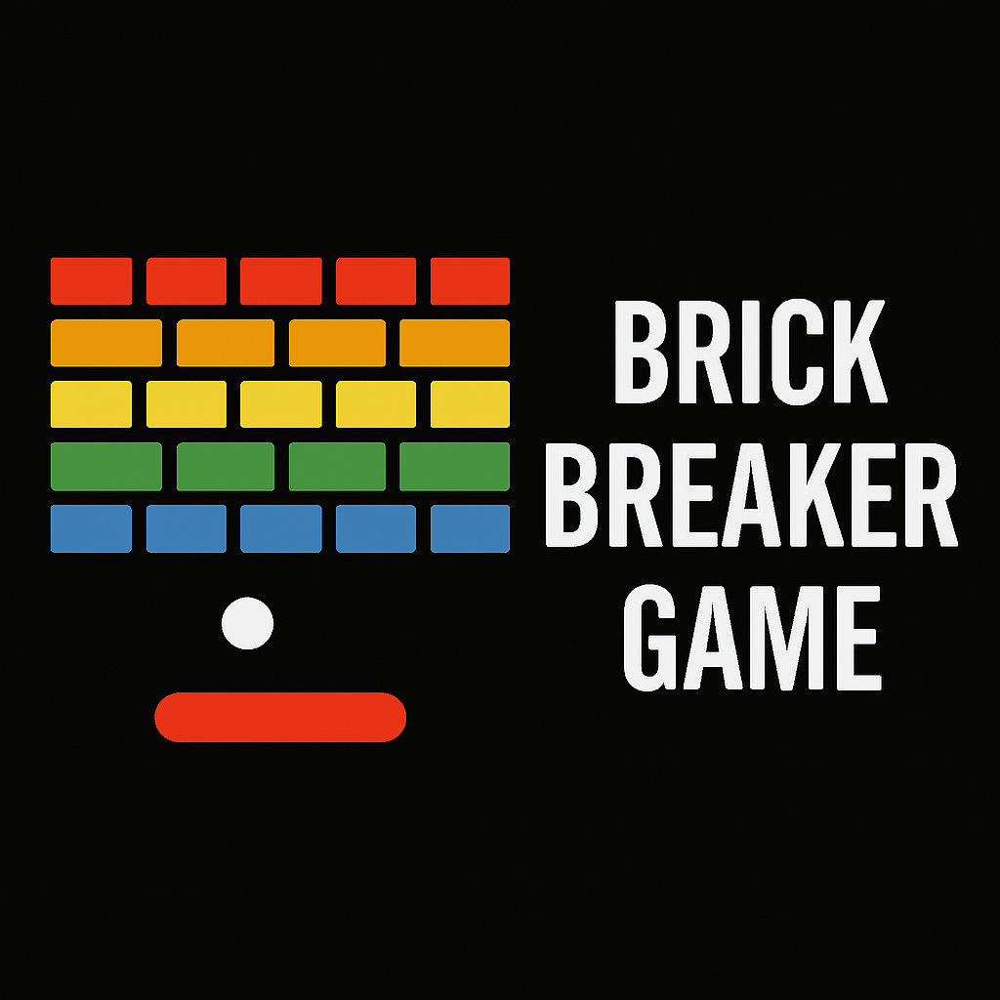

# 🎮 Brick Breaker Deluxe

Un jeu de casse-briques moderne et personnalisable, développé en **HTML**, **CSS** et **JavaScript**.  
Inspiré des classiques arcade, mais enrichi avec des niveaux progressifs, des skins, des sons et des fonctionnalités modernes ! 💥

---

## 🧩 Fonctionnalités

- 🕹️ **Contrôles au choix** : clavier ou souris.
- 🔥 **Pouvoirs spéciaux** : briques explosives.
- 🧠 **Niveaux dynamiques** : vitesse qui augmente avec la difficulté.
- 🛑 **Système de pause** : appuie sur `Espace` pour interrompre et reprendre.
- 🎨 **Choix de skins** : Classique, Néon ou Galaxy.
- 📱 **Compatible mobile** : contrôle tactile inclus.
- 🏆 **Highscore** enregistré en local.
- 📘 **Instructions intégrées** pour guider les nouveaux joueurs.

---

## 🎮 Commandes

### Mode Clavier :
- `← →` : déplacer la palette
- `↑` : lancer la balle
- `Espace` : pause / reprise

### Mode Souris :
- Bouger la souris pour contrôler la palette
- Cliquer pour lancer la balle

---

## 🗂️ Fichiers du projet

| Fichier        | Rôle                                       |
|----------------|--------------------------------------------|
| `index.html`   | Structure du jeu                          |
| `style.css`    | Design général, responsive et skins        |
| `script.js`    | Logique du jeu et animation               |
| `hit.mp3`      | Son de rebond                             |
| `lose.mp3`     | Son de perte de vie                       |
| `power.mp3`    | Son de pouvoir spécial (explosion)        |

---

## 🚀 Lancer le jeu

Tu peux :
- Lancer `index.html` localement dans ton navigateur, **ou**
- Y jouer en ligne à l'adresses suivante : https://j0yb0y28.github.io/brick-breaker-game-main/.

---

## ✨ Capture d’écran

 <!-- Tu peux ajouter une capture d'écran de ton jeu ici -->

---

## 👨‍💻 Auteur

Développé avec ❤️ par Teddy Kana.  
Licence : MIT – libre à modifier et à partager !
